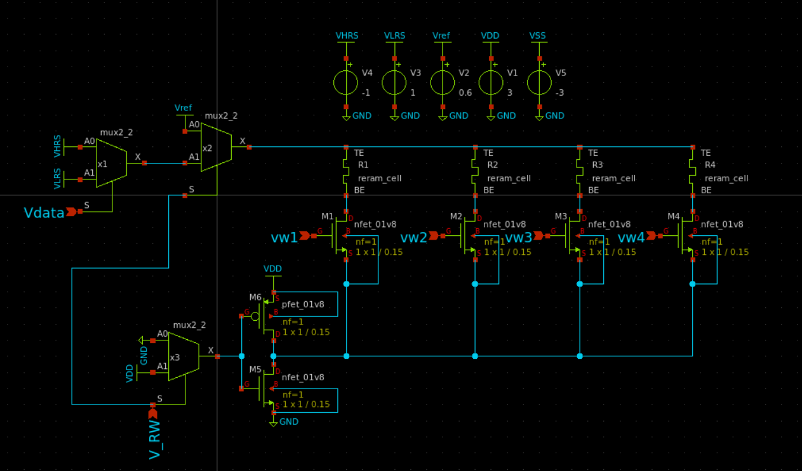

# Esquemático Crossbar 1T1M

El esquemático Crossbar 1T1M es una estructura comúnmente usada en la tecnología de memoria ReRAM (Memoria de Acceso Aleatorio Resistiva). Esta arquitectura utiliza un tránsito (1T) y un dispositivo de memoria (1M) para cada celda de memoria en la matriz. 

La tecnología ReRAM es una clase de memoria no volátil que cambia la resistencia en un material dieléctrico, a menudo un óxido metálico. La resistencia se cambia aplicando un voltaje al material, y puede ser medida para leer el estado de la memoria.

ReRAM tiene muchas ventajas sobre otras tecnologías de memoria no volátiles, incluyendo baja potencia y alta velocidad de escritura. También puede ser escalada a tamaños muy pequeños, lo que la hace adecuada para aplicaciones de alta densidad.
